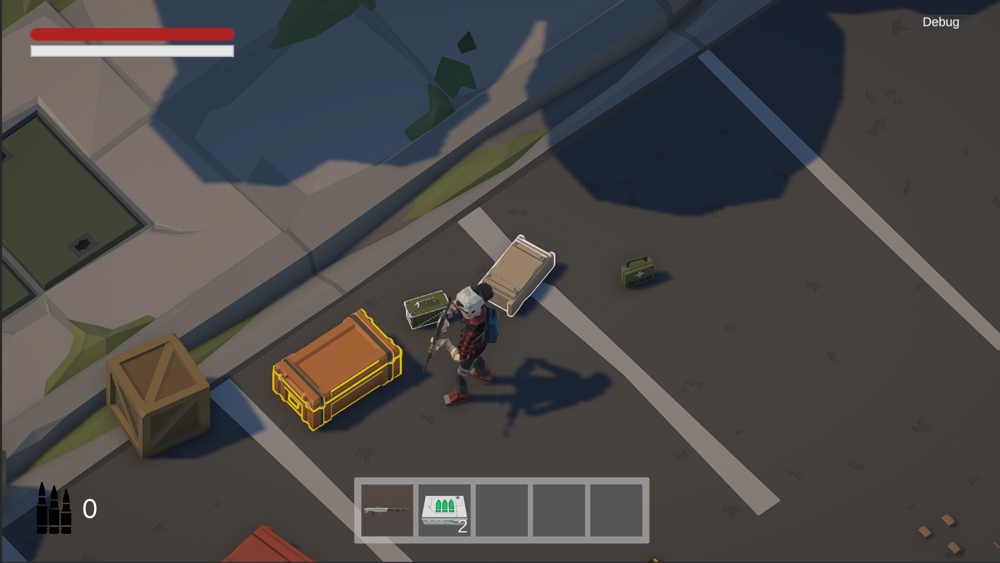
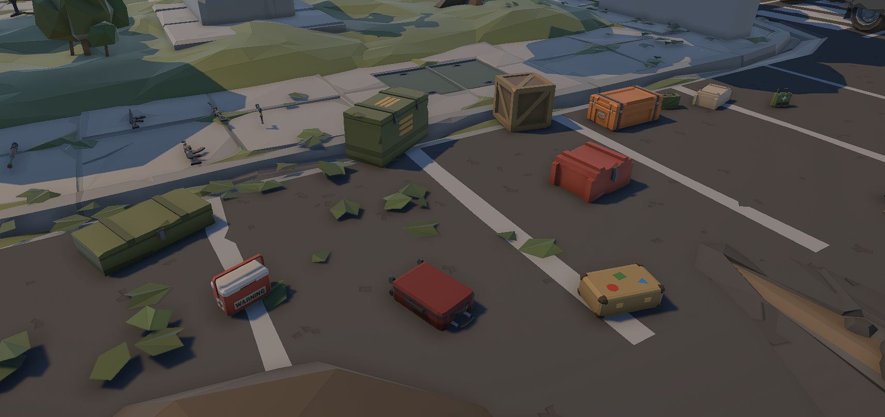
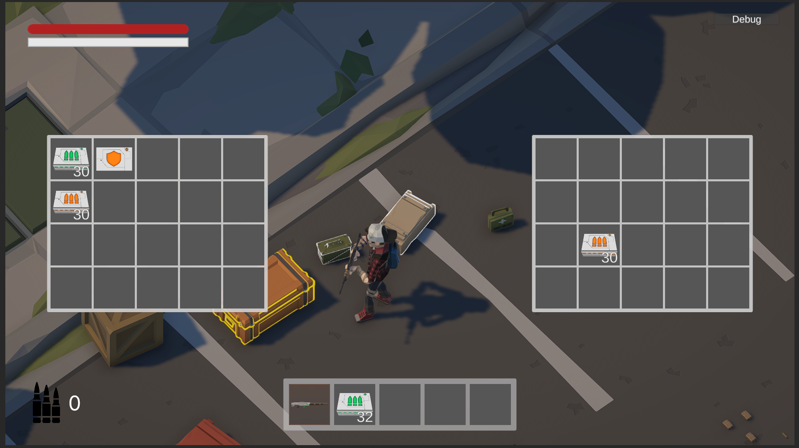
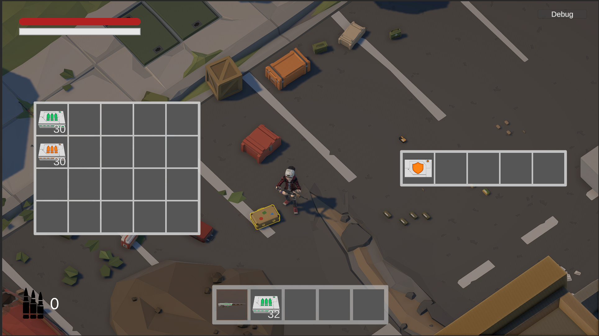
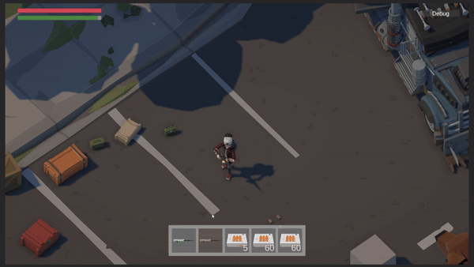
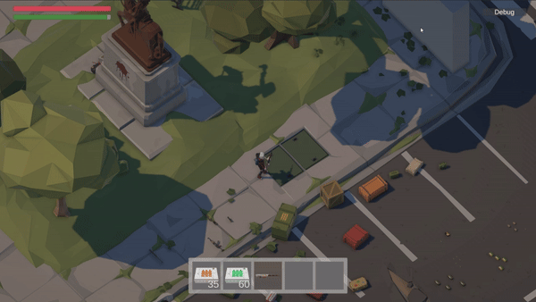
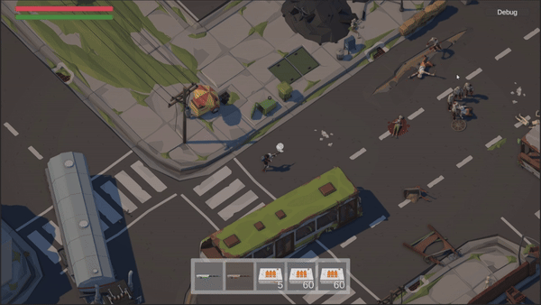

# Last-days-on-earth
Post-apocalyptic survival game. Portfolio project for Unity Developer position. 
Here you can check core-mechanics and overall game review.
# Raiders VS Zombies
Raiders can attack Zombies, Zombies can attack Raiders and all of them wouldn't mind killing you.

# Select Items
You can select item to interact with, such as crates, weapons, medicine, etc.
Current interactable is highlighted by orange outline, all available interactables are highlighted by white outline.

# Different crates have different storage size 

# Work with your items

# Different weapons included

# Fight with Zombies and Raiders

